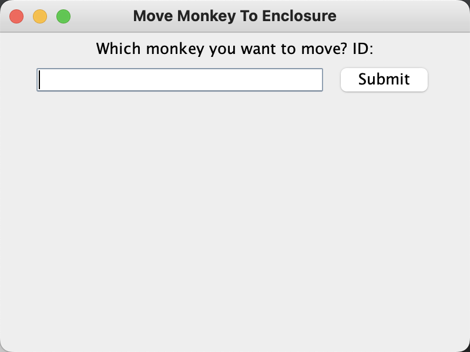

# Project6 - Primates MVC
## Overview:

The Monkey Sanctuary Management System is a Java-based application for managing a monkey sanctuary. The system allows users to perform various tasks, including adding a monkey, vaccinating a monkey, moving a monkey to an enclosure, getting a list of monkeys of a certain enclosure, and getting a list of all monkeys housed in the sanctuary. 

## List of features
**1. Add Monkey Feature:**

   The user would be able to register new monkeys into the sanctuary, new arrivals go straight into isolation.

**2. Vaccinate Monkey Feature:**

The user can mark a certain monkey as vaccinated by submitting the ID of the monkey.

**3. Move Monkey Feature:**

   The user should be able to move to the right enclosure monkeys that have received medical attention. 

**4. Show Enclosure Monkey List Feature:**

   It could produce a list for every enclosure. Each enclosure list shows each individual monkey that is currently housed there (for each monkey, include their name, sex, and favourite food)

**5. Show All Monkey List Feature:**
   
   Produce an alphabetical list (by name) of all of the monkeys housed in the Sanctuary

## How To Run
Dependency Information: JDK Java8 or higher vision.

**1.In IntelliJ IDEA**

Open the file in IntelliJ IDEA, double click the run button.

**2.In Command Line:**

Locate the file, cd res folder.

`cd res`

`java -jar proj6.jar`

(NOTES:  It is normal to encounter font-related errors due to font installation issues. Just ignore this.)

## How to Use the Program
### Start the Program & Main Page
When  run the Monkey Sanctuary Management System, you will be presented with a **Main page** 
that allows you to choose from various options. 
To perform a task, click on the corresponding button, 
and you will be taken to a new page where you can enter 
the necessary information.

Main Page:

### Add Monkey Button
Click `Add Monkey` Button in the Main Page, you will be guided to the Add Monkey Page.
The Add Monkey Page displays a form to add monkey information.
The attributes its expect form are listed as following:

- ID: int, 

- Name: String, 

- Species: Select box,

- Sex: Select Box,

- Size: Double, 

- Weight: Double, 

- Age: Double, 

- Favourite Food: Select Box.

After entering all the information, click the Submit button, 
the system will generate a new monkey based on user information.
The new Monkey will be hosted in the Isolation area, and be marked t as not having received medical attention.

If Successfully added, you can see the following message:

If the input type is different from the type expected by the program, 
an error message will be displayed to you.

As the Isolation Area has the maxium capacity of 20, if the Isolation area is full, you will see the following messase.

### Vaccinate Monkey Button
Click `Vaccinate Monkey` Button in the Main Page, you will be guided to the Vaccinate Page.
The Vaccinate page allows you to enter the ID of the monkey to be vaccinated.
You can submit the ID and the corresponding monkey will be vaccinated.

The attributes its expect form are listed as following:
- ID: int

If Successfully vaccinated, you can see the following message:

If the Monkey ID you entered has already been vaccinated, you can see the following error message:

If the Monkey ID you entered does not exist, you can see the following error message:

### Move Monkey to Enclosure Button
Click `Movee Monkey to Enclosure` Button in the Main Page, you will be guided to the Move Monkey Page.
The Move Monkey page allows you to enter the ID of the monkey to be moved.
You can submit the ID and the corresponding monkey will be moved to corresponding enclosure.

The attributes its expect form are listed as following:
- ID: int

If successfully moved, you can see the following message:

If the Monkey has not been vaccinated, you can see the following error message:

If the Monkey ID you entered has already been moved, you can see the following error message:

If the Monkey ID you entered does not exist, you can see the following error message:

### Get List For every enclosure Button
Click `Get List For every enclosure Button` Button in the Main Page, you will be guided to the Get list Page.
The Get List page allows you to select the species of enclosure you want to check.
You can submit the species and the corresponding enclosure list will be shown via dialog.

The attributes its expect form are listed as following:
- Species: Check Box

If successfully, you can see the following message, for each monkey, including their name, sex, and favourite food.

If the enclosure is empty, you can see the following message:

### Get all monkeys housed in the Sanctuary Button
Click `Get all monkeys housed in the Sanctuary` Button in the Main Page,
an alphabetical list (by name) of all of the monkeys housed in the Sanctuary will be shown via dialog.

## Design/Model Changes

UML of this Project:

## Assumptions
In this Project, I assume the ID of each monkey is unique.

## Limits
As I assume that each monkey has a unique ID, there is currently no function to handle situations where there are duplicate IDs.

## Citations
Instruction to generate README: https://northeastern.instructure.com/courses/136689/pages/what-is-a-readme

Markdown Syntax: https://www.markdownguide.org/getting-started/

Project Description: https://northeastern.instructure.com/courses/136689/assignments/1711175